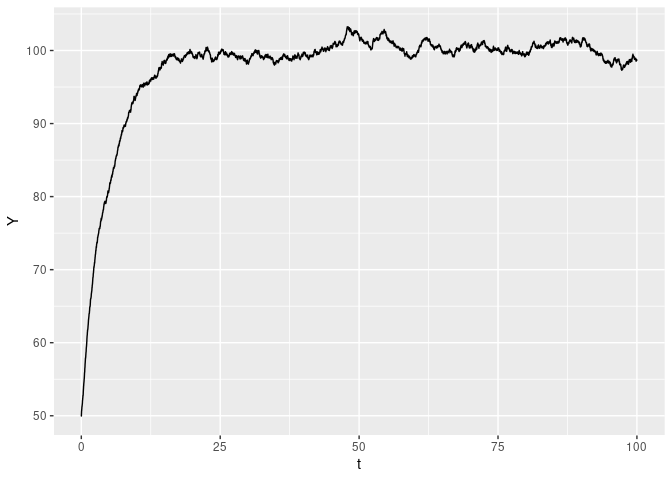

## tsmodels - Time series models in R

#### Overview

The **tsmodels** package implements several families of time-series
models. The current version includes:

  - Ornstein-Uhlenbeck process (models spread of pairs-trading
    strategies, etc)

  - Geometric Ornstein-Uhlenbeck process (models mean-reverting price
    series, etc)

  - Geometric Brownian motion (models stock prices, indices, etc)

  - etc

#### Instalation

The easiest way begin using the package is by directly installing it on
RStudio from github:

``` r
remotes::install_github('joaodmrodrigues/tsmodels')
```

Alternatively, you can clone to repository to your local machine using
git:

``` bash
git clone https://github.com/joaodmrodrigues/tsmodels.git
```

#### Usage

The package is organized as a collection of several functions, each
implementing a different time-series model. You can find more detailed
examples and technical explanations of each model in the vignettes
folder.

As an example, let’s generate a single realization of the
Ornstein-Uhlenbeck process:

``` r
library(tsmodels)

T <- 100
dt <- 0.01
mu <- 100
sigma <- 1
tau <- 5
Y0 <- 50

result <- Ornstein_Uhlenbeck(T=T, dt=dt, mu=mu, sigma=sigma, tau=tau, Y0=Y0)
t <- result[[1]]
Y <- result[[2]]
```

Let’s use ggplot to plot the path:

``` r
library(tidyverse)
```

``` r
ggplot()+
    geom_line(mapping = aes(x=t, y=Y), color="black")
```

<!-- -->
